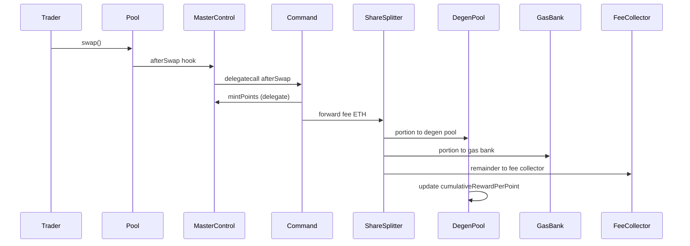
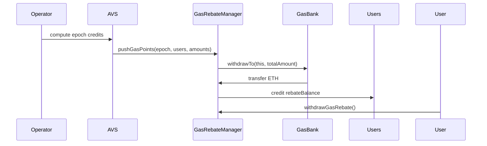
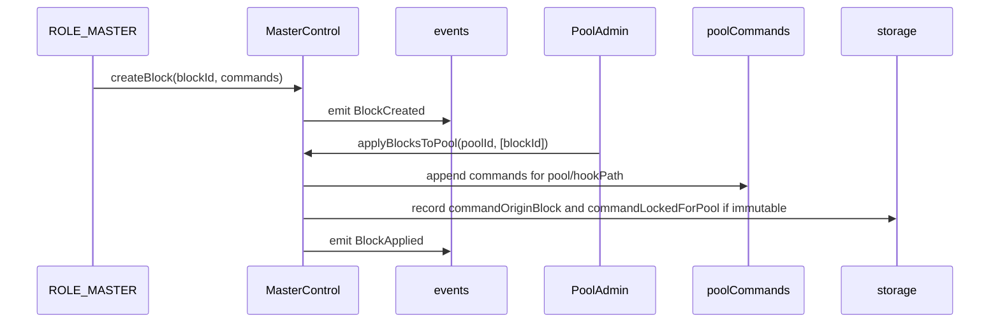
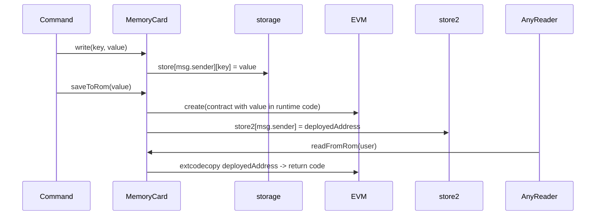

# Bonded Hooks — Uniswap v4 Hook Management (UHI6 Hookathon)

Turn Uniswap v4 hooks into a marketplace:
- Pool admins compose behavior from small "blocks" instead of writing Solidity.
- The community can fund and bond new hooks; bonders earn a share of fees.
- A points/rebates rail offsets trader gas and rewards participation.

What this is
Bonded Hooks is an experimental research project that makes Uniswap v4 hooks easier to use and easier to fund. Pool admins pick and arrange small "blocks" (bundles of commands). Developers can publish commands and earn bounties; bonders provide funding that funds both developer rewards and gas backstops.

Where the AVS code lives
- Rebate AVS runtime and helpers: [`Bonded-hooks/operator/DegenAVS.ts:1`](Bonded-hooks/operator/DegenAVS.ts:1) and [`Bonded-hooks/operator/processor.ts:1`](Bonded-hooks/operator/processor.ts:1)
- Shaker AVS runtime and helpers: [`Bonded-hooks/operator/ShakerAVS.ts:1`](Bonded-hooks/operator/ShakerAVS.ts:1) and [`Bonded-hooks/operator/shakerProcessor.ts:1`](Bonded-hooks/operator/shakerProcessor.ts:1)
- Operator README / run instructions: [`Bonded-hooks/operator/README.md:1`](Bonded-hooks/operator/README.md:1)

Who it's for
- Pool admins — apply and manage hook behavior safely via blocks and allowlists.
- Builders — implement focused command logic, claim bounties, and share in fees.
- Bonders — back promising hooks and earn a share of long-term fees.
- Traders — receive points and gas rebates when pools enable rebate-enabled hooks.
- LPs — prize mechanics aim to donate extra yield directly to pools to offset impermanent loss.

Why it matters
- Blocks make powerful hook behavior accessible to non-developers.
- Bonding aligns incentives: funds the work and funds a gas backstop for users.
- Off-chain AVS operators and on-chain rails (GasBank, DegenPool) enable accountable rebate and reward distribution.

How it works (plain English)
- MasterControl receives Uniswap v4 hook callbacks and executes an ordered list of approved commands for the pool/hook.
- Commands are small, single-purpose contracts (for example, minting points). Pool admins assemble commands into whitelisted "blocks."
- A bonded marketplace lets anyone propose a hook and bond ETH. Bonds split between developer bounties and gas backstops; when a command is published and used, bonders earn fees.
- Points and rebates: a DegenPool (points) and GasBank (rebates) provide on-chain rails that AVS operators credit per epoch; prize rounds donate funds back into pools.

What’s built today
- MasterControl — dispatcher for all v4 callbacks with per-pool command lists, allowlists, immutability flags, conflict groups, and provenance tracking.
- Commands & Blocks — example: PointsCommand demonstrates how commands plug in; blocks package commands for pool admins to apply.
- Bonding — ETH-only bonds with rewards-per-share accounting (the “bond once, earn forever” model).
- DegenPool — points-based reward pool that receives funds and pays out proportional rewards.
- ShareSplitter / GasBank / GasRebateManager / FeeCollector — rails to split fees, hold rebate funds, credit users, and collect platform fees.
- MemoryCard — per-pool key/value storage and optional immutable “ROM” storage for lightweight long-term data.
- PoolLaunchPad & AccessControl — helpers for token/pool creation and central role management.
- Tests & scripts — unit/integration tests and deploy scripts cover the implemented components.

What’s coming next
- Per-swap dynamic fee capture and routing to DegenPool, Bonding, and fee collectors (tiny pips-based fees).
- A default “degen tax” example to fund points and rewards (e.g., 0.01% per swap).
- Operator hardening: multisig, Merkle proofs, and lock-pattern audits for safer on-chain interactions.
- Shaker & Prize mechanics: time-extended rounds that donate to pools to offset impermanent loss.
- A drag-and-drop UI for non-technical pool admins.
- Formal audits and production security hardening.

A simple story: what a pool admin does
1) Create a pool with PoolLaunchPad — you are registered as the pool admin.
2) Open the catalog of approved blocks and apply a starter block (for example, PointsCommand).
3) When new blocks are approved, add them; immutability and conflict rules are enforced by MasterControl.
4) When fee-enabled blocks are active a small per-swap fee funds rewards and rebates.

A simple story: how a new hook gets funded
- A contributor proposes a hook with an IPFS spec and supporters bond ETH to fund the request.
- Bond splits: half becomes a developer bounty, half becomes a gas backstop.
- A developer implements and tests the command; upon admin approval the block is published.
- Once live, bonders receive a share of that hook’s fees across pools that use it.

Safety & limitations
- Experimental research software — not audited. Do not use on mainnet; use local testnets or sandboxes.
- Commands may run via delegatecall. Only approved targets should be allowed; review and audits are required.
- Atomicity: if a command reverts, the entire hook callback reverts.
- AVS/operator trust: the demo uses a centralized operator for rebates; in production this should be hardened (multisig, operator governance, or Merkle-based proofs).

What you can run today (developers)
- Run the test suite to exercise end-to-end behaviors.
- Use the provided deploy scripts to deploy locally (see scripts/ and operator integration helpers).
- Explore `src/` and `test/` for contract implementations and tests. Note: fee-taking commands are planned — the current example focuses on points.

Key components at a glance
- MasterControl: hook dispatcher and command manager
- Commands: single-purpose behavior units
- Blocks: curated bundles of commands with allowlists and immutability semantics
- Bonding: bond funding and rewards-per-share accounting
- DegenPool: points accumulation and reward distribution
- ShareSplitter / GasBank / GasRebateManager: fee splitting and rebate rails
- MemoryCard: per-pool storage & ROM-style blob storage
- AccessControl / PoolLaunchPad: roles and pool setup helpers

FAQ
- Is this live on mainnet? No — this is a hackathon research project and not audited.
- Do I need to code to use it? The goal is low-code; currently the repo is developer-focused until the UI is finished.
- Can I unbond? No — bonds follow the “bond once, earn forever” model via rewards-per-share.
- Who pays fees? Traders pay a small per-swap fee when fee-enabled commands are active.
- What about security? This is research software; delegatecall and operator trust require audits before production.

Status
- In development for the UHI6 Hookathon.
- Not audited; expect sharp edges. Do not use in production.

Core concepts
- MasterControl: hook dispatcher and command manager that routes Uniswap V4 hook events to ordered Command[] lists per pool and hookPath. See [`Bonded-hooks/src/MasterControl.sol:33`](Bonded-hooks/src/MasterControl.sol:33).
- Commands: small contracts (often executed via delegatecall) that implement hook behavior (e.g., mint points, forward fees). Example: [`Bonded-hooks/src/PointsCommand.sol:25`](Bonded-hooks/src/PointsCommand.sol:25).
- Blocks & provenance: commands are packaged into whitelisted blocks (ALL_REQUIRED semantics) that can be applied to pools; MasterControl records provenance and immutability. See block lifecycle in [`Bonded-hooks/src/MasterControl.sol:709`](Bonded-hooks/src/MasterControl.sol:709).

Fee, bonding, and rewards
- Bonding: bond principal + rewards-per-share accounting used to fund hooks and reward bonders. See [`Bonded-hooks/src/Bonding.sol:15`](Bonded-hooks/src/Bonding.sol:15).
- ShareSplitter: splits incoming ETH according to Settings (default or per-sender) and forwards to recipients (DegenPool, GasBank, FeeCollector). See [`Bonded-hooks/src/ShareSplitter.sol:7`](Bonded-hooks/src/ShareSplitter.sol:7).
- GasBank / GasRebateManager: GasBank holds ETH for gas rebates; GasRebateManager is credited by an off-chain AVS operator per epoch and users withdraw rebates. See [`Bonded-hooks/src/GasBank.sol:8`](Bonded-hooks/src/GasBank.sol:8) and [`Bonded-hooks/src/GasRebateManager.sol:19`](Bonded-hooks/src/GasRebateManager.sol:19).
- FeeCollector: simple placeholder vault for platform fees. See [`Bonded-hooks/src/FeeCollector.sol:6`](Bonded-hooks/src/FeeCollector.sol:6).

Pool lifecycle and auxiliary systems
- PoolLaunchPad: token + pool creation helper; registers pool admin in AccessControl on initialize. See [`Bonded-hooks/src/PoolLaunchPad.sol:26`](Bonded-hooks/src/PoolLaunchPad.sol:26).
- DegenPool: points-based reward pool that receives a portion of hook fees, mints/settles points, and pays rewards. See [`Bonded-hooks/src/DegenPool.sol:15`](Bonded-hooks/src/DegenPool.sol:15).
- MemoryCard: per-user key/value storage plus ROM-style storage (deploys a small contract with payload). Commands read/write per-pool config to MemoryCard. See [`Bonded-hooks/src/MemoryCard.sol:12`](Bonded-hooks/src/MemoryCard.sol:12).
- AccessControl: central role and per-pool admin registry used across contracts. See [`Bonded-hooks/src/AccessControl.sol:9`](Bonded-hooks/src/AccessControl.sol:9).

Other utilities
- BidManager: simple on-chain bid registry used by the AVS workflow for epoch bidding. See [`Bonded-hooks/src/BidManager.sol:6`](Bonded-hooks/src/BidManager.sol:6).
- Create2Factory: deterministic deploy helper used by scripts/tests. See [`Bonded-hooks/src/Create2Factory.sol:6`](Bonded-hooks/src/Create2Factory.sol:6).
- IMemoryCard: interface consumed by commands when interacting with MemoryCard. See [`Bonded-hooks/src/IMemoryCard.sol:6`](Bonded-hooks/src/IMemoryCard.sol:6).

Files referenced
- MasterControl: [`Bonded-hooks/src/MasterControl.sol:33`](Bonded-hooks/src/MasterControl.sol:33)
- Bonding: [`Bonded-hooks/src/Bonding.sol:15`](Bonded-hooks/src/Bonding.sol:15)
- MemoryCard: [`Bonded-hooks/src/MemoryCard.sol:12`](Bonded-hooks/src/MemoryCard.sol:12)
- ShareSplitter: [`Bonded-hooks/src/ShareSplitter.sol:7`](Bonded-hooks/src/ShareSplitter.sol:7)
- GasBank: [`Bonded-hooks/src/GasBank.sol:8`](Bonded-hooks/src/GasBank.sol:8)
- GasRebateManager: [`Bonded-hooks/src/GasRebateManager.sol:19`](Bonded-hooks/src/GasRebateManager.sol:19)
- DegenPool: [`Bonded-hooks/src/DegenPool.sol:15`](Bonded-hooks/src/DegenPool.sol:15)
- PointsCommand: [`Bonded-hooks/src/PointsCommand.sol:25`](Bonded-hooks/src/PointsCommand.sol:25)

1) Fee flow (per-swap)

Description
- A swap that triggers hooks flows through `MasterControl` which dispatches configured commands. See dispatcher in [`Bonded-hooks/src/MasterControl.sol:244`](Bonded-hooks/src/MasterControl.sol:244).
- Commands may collect a fixed command fee (`COMMAND_FEE_BIPS`) and forward ETH to `ShareSplitter` or `Bonding`. Example command: [`Bonded-hooks/src/PointsCommand.sol:40`](Bonded-hooks/src/PointsCommand.sol:40).

Notes
- `MasterControl` runs commands in order and supports delegatecall/call variants. See run loop at [`Bonded-hooks/src/MasterControl.sol:394`](Bonded-hooks/src/MasterControl.sol:394).
- Commands expose a `COMMAND_FEE_BIPS` getter which `MasterControl` reads when applying blocks to aggregate fees per-target. See `_getCommandFeeBips` at [`Bonded-hooks/src/MasterControl.sol:906`](Bonded-hooks/src/MasterControl.sol:906).

2) Rebate flow (AVS epoch processing)

Description
- An off-chain AVS operator computes per-user gas rebates for an epoch and pushes them on-chain.
- `GasRebateManager.pushGasPoints` pulls ETH from `GasBank` then credits users. See [`Bonded-hooks/src/GasRebateManager.sol:82`](Bonded-hooks/src/GasRebateManager.sol:82).

Notes
- `GasBank` only allows its configured `rebateManager` to call `withdrawTo`. See [`Bonded-hooks/src/GasBank.sol:55`](Bonded-hooks/src/GasBank.sol:55).
- `GasRebateManager` stores `rebateBalance` per-user; users call `withdrawGasRebate` to receive ETH.
## EigenLayer integration (AVS operators)

This project treats the AVS operator components as services that can be run and managed by EigenLayer-style operator infrastructure. In short: the AVS processes are off-chain services that sign transactions with an AVS account; that account must be authorized on-chain (via `setAVS` / operator admin calls) so the contracts accept AVS actions.

Where the AVS code lives
- Rebate AVS runtime and helpers: [`Bonded-hooks/operator/DegenAVS.ts:1`](Bonded-hooks/operator/DegenAVS.ts:1) and [`Bonded-hooks/operator/processor.ts:1`](Bonded-hooks/operator/processor.ts:1)
- Shaker AVS runtime and helpers: [`Bonded-hooks/operator/ShakerAVS.ts:1`](Bonded-hooks/operator/ShakerAVS.ts:1) and [`Bonded-hooks/operator/shakerProcessor.ts:1`](Bonded-hooks/operator/shakerProcessor.ts:1)
- Operator README / run instructions: [`Bonded-hooks/operator/README.md:1`](Bonded-hooks/operator/README.md:1)

How this maps to EigenLayer
- Operator hosting: run the AVS process (the Node/ts runtime above) on an EigenLayer operator node (or other secure operator/service). The runtime needs:
  - a JSON-RPC endpoint (RPC_URL)
  - an AVS signer/private key (PRIVATE_KEY) — in EigenLayer deployments this is typically the operator's managed signer
  - configured contract addresses (e.g., SHAKER_ADDRESS, PRIZEBOX_ADDRESS, GAS_REBATE_ADDRESS)
- On-chain authorization: for each contract that restricts AVS calls, set the AVS address to the operator signer:
  - Shaker AVS must be allowed via `setAVS(...)` on the Shaker contract: see [`Bonded-hooks/src/Shaker.sol:107`](Bonded-hooks/src/Shaker.sol:107)
  - PrizeBox AVS allowance is set via `setAVS(...)` on the PrizeBox contract: see [`Bonded-hooks/src/PrizeBox.sol:98`](Bonded-hooks/src/PrizeBox.sol:98)
  - The rebate operator role / operator address for the gas rebate path is configured in the GasRebateManager contract (see [`Bonded-hooks/src/GasRebateManager.sol:19`](Bonded-hooks/src/GasRebateManager.sol:19))
- Runtime configuration: after deploying contracts, configure the operator env vars as described in [`Bonded-hooks/operator/README.md:1`](Bonded-hooks/operator/README.md:1) and ensure the on-chain AVS address matches the operator signer.

3) applyBlocksToPool lifecycle (MasterControl block application)

Description
- Owner/ROLE_MASTER creates whitelisted blocks of commands (ALL_REQUIRED semantics). Blocks may be flagged immutable or assigned a conflict group.
- Pool admin calls `applyBlocksToPool` to append block commands to their pool. Provenance and immutability are recorded so that later `setCommands`/`clearCommands` cannot remove locked commands.

Notes
- `applyBlocksToPool` validates block enabled status, expiry, conflict groups, and approved targets before applying. See validation starting at [`Bonded-hooks/src/MasterControl.sol:773`](Bonded-hooks/src/MasterControl.sol:773).

4) MemoryCard ROM lifecycle (saveToRom / readFromRom)

Description
- `MemoryCard` provides caller-scoped key/value storage and a ROM path where arbitrary data is saved into a tiny deployed contract (creation code + payload). This can store immutable blobs retrievable via `readFromRom`.

Notes
- `saveToRom` deploys a minimal contract with the payload as runtime bytecode and stores the deployed address in `store2` keyed by sender. See implementation at [`Bonded-hooks/src/MemoryCard.sol:47`](Bonded-hooks/src/MemoryCard.sol:47).

Appendix and further reading
- For command examples see [`Bonded-hooks/src/PointsCommand.sol:25`](Bonded-hooks/src/PointsCommand.sol:25).
- For bonding and rewards-per-share distribution see [`Bonded-hooks/src/Bonding.sol:15`](Bonded-hooks/src/Bonding.sol:15).
- For pool lifecycle and admin registration see [`Bonded-hooks/src/PoolLaunchPad.sol:26`](Bonded-hooks/src/PoolLaunchPad.sol:26).

## High-level architecture
- Master dispatcher: [`Bonded-hooks/src/MasterControl.sol:33`] accepts Uniswap V4 hook callbacks and dispatches them to ordered Command lists per pool.
- Per-pool storage: configuration and state for commands and controllers lives in [`Bonded-hooks/src/MemoryCard.sol:12`].
- Bonding and rewards: fee bonds and rewards accounting implemented in [`Bonded-hooks/src/Bonding.sol:15`].
- Fee splitting and payout infrastructure: [`Bonded-hooks/src/ShareSplitter.sol:7`], [`Bonded-hooks/src/GasBank.sol:8`], [`Bonded-hooks/src/GasRebateManager.sol:19`], [`Bonded-hooks/src/FeeCollector.sol:6`].
- Auxiliary: pool creation via [`Bonded-hooks/src/PoolLaunchPad.sol:26`], points pool [`Bonded-hooks/src/DegenPool.sol:15`].

## Components

### MasterControl
Responsibilities:
- Receives Uniswap V4 hook callbacks and translates `PoolKey` into internal hookPath and poolId.
- Runs ordered `Command[]` for a given pool/hook and supports both delegatecall and call execution modes.
- Manages approved command targets and whitelisted command blocks (createBlock, applyBlocksToPool, revokeBlock).
- Tracks provenance and immutability for commands applied to pools.
See implementation at [`Bonded-hooks/src/MasterControl.sol:33`].

### Command model
- Commands are small contracts exposing typed hook entrypoints (for example `afterSwap`) and may run via delegatecall.
- Commands should expose a `COMMAND_FEE_BIPS()` getter if they charge per-call fees; MasterControl reads this value when blocks are applied.
- Commands use `MemoryCard` for persistent per-pool or per-user configuration.
Example command: [`Bonded-hooks/src/PointsCommand.sol:25`].

### MemoryCard
- Provides caller-scoped key/value storage (`write`, `read`, `clear`) and ROM-style storage via `saveToRom`/`readFromRom`.
- ROM storage deploys a minimal contract whose runtime bytecode contains the payload. The deployed address is stored per-sender.
See [`Bonded-hooks/src/MemoryCard.sol:12`].

### Bonding and Fee Routing
- Bonding contract ([`Bonded-hooks/src/Bonding.sol:15`]) holds bonded principal and calculates per-target rewards via `rewardsPerShare`.
- Fee routing is expected to forward command fees into Bonding and/or ShareSplitter depending on command logic.
- ShareSplitter ([`Bonded-hooks/src/ShareSplitter.sol:7`]) consumes ETH and forwards portions to recipients defined in `Settings`.
- GasBank ([`Bonded-hooks/src/GasBank.sol:8`]) holds ETH for gas rebates; GasRebateManager ([`Bonded-hooks/src/GasRebateManager.sol:19`]) pulls funds per epoch to credit users.

### DegenPool and Prizes
- DegenPool ([`Bonded-hooks/src/DegenPool.sol:15`]) accumulates a portion of hook fees as points rewards. Points are minted by commands or the AVS operator and are used for reward distribution and games.
- PrizeBox and Shaker (not fully covered here) coordinate timed bonus games that draw from split fees and DegenPool credits.

## Key data flows
- Fee flow per swap: trader -> pool -> MasterControl -> command -> ShareSplitter/Bonding/GasBank. See `docs/flows.md` for diagrams.
- Rebate flow: AVS operator computes per-user rebates -> GasRebateManager.pushGasPoints -> GasBank.withdrawTo -> user balances -> withdrawGasRebate.
- Block apply lifecycle: ROLE_MASTER creates block(s) -> pool admin applies block to pool -> MasterControl validates and appends commands -> provenance recorded; commands may be locked/immutable.

## Extensibility points
- New commands: implement typed hook entrypoints, expose `commandMetadata()` and optional `COMMAND_FEE_BIPS()`.
- MemoryCard: use per-pool keys (keccak256 of key + poolId) to store configuration without expanding MasterControl storage.
- Additional AVS integrations: `GasRebateManager` and `BidManager` are designed to accept off-chain operator input; these can be extended to accept Merkle proofs or multisig operator sets.

## Security considerations
- Delegatecall usage: Many commands run via delegatecall into MasterControl context. Commands MUST be audited because they execute with MasterControl storage context.
- Immutable provenance: use block immutability and per-command locks to prevent pool admins from removing critical commands.
- Funds custody: GasBank and FeeCollector hold ETH; ensure admin keys and AccessControl are secured. GasBank allows only `rebateManager` to withdraw.
- Reentrancy: Bonding uses a simple nonReentrant guard. Commands and any external ERC20 transfers should use safe calls and checks.

## Testing Notes
- Tests present in `Bonded-hooks/test/` cover MasterControl blocks, Bonding, DegenPool, and GasRebateManager behaviors. Key tests to review: `masterControl.t.sol`, `Bonding.t.sol`, `DegenPool.t.sol`, `GasRebateManager.t.sol`.

Notes:
- All role definitions are declared as bytes32 public constant ROLE_* in the contract files.
- AccessControl registry is the on-chain central role store: [`Bonded-hooks/src/AccessControl.sol:9`]
- Many contracts implement a helper that prefers AccessControl.hasRole when configured and falls back to owner equality when AccessControl is zero address.

Roles

1) ROLE_MASTER
- Declared in: [`Bonded-hooks/src/MasterControl.sol:60`]
- Enforced by: MasterControl (checks via _isMasterAdmin) when configuring commands, blocks, memoryCard, poolLaunchPad, etc. See [`Bonded-hooks/src/MasterControl.sol:62`]
- Legacy owner fallback: yes (owner defined at [`Bonded-hooks/src/MasterControl.sol:57`], fallback in `_isMasterAdmin` at [`Bonded-hooks/src/MasterControl.sol:64`])
- Purpose: master-level contract operations (approve commands, create/revoke blocks, set memoryCard)

2) ROLE_SETTINGS_ADMIN
- Declared in: [`Bonded-hooks/src/Settings.sol:18`]
- Enforced by: Settings via `_isSettingsAdmin` at [`Bonded-hooks/src/Settings.sol:129`]
- Legacy owner fallback: yes (owner at [`Bonded-hooks/src/Settings.sol:16`])
- Purpose: manage default/custom share splits used by ShareSplitter

3) ROLE_FEE_COLLECTOR_ADMIN
- Declared in: [`Bonded-hooks/src/FeeCollector.sol:15`]
- Enforced by: FeeCollector methods like `setSettings` and `ownerWithdraw` via `_isAdmin` at [`Bonded-hooks/src/FeeCollector.sol:41`]
- Legacy owner fallback: yes (owner at [`Bonded-hooks/src/FeeCollector.sol:13`])
- Purpose: manage FeeCollector config and withdrawals

4) ROLE_GAS_BANK_ADMIN
- Declared in: [`Bonded-hooks/src/GasBank.sol:12`]
- Enforced by: GasBank admin methods (`setRebateManager`, `setShareSplitter`, `ownerWithdraw`) via `_isGasBankAdmin` at [`Bonded-hooks/src/GasBank.sol:72`]
- Legacy owner fallback: yes (owner at [`Bonded-hooks/src/GasBank.sol:10`])
- Purpose: manage vault settings and recovery

5) ROLE_GAS_REBATE_ADMIN
- Declared in: [`Bonded-hooks/src/GasRebateManager.sol:23`]
- Enforced by: GasRebateManager admin methods (`setGasBank`, `setOperator`, `ownerWithdraw`) via `_isAdmin` at [`Bonded-hooks/src/GasRebateManager.sol:139`]
- Legacy owner fallback: yes (owner at [`Bonded-hooks/src/GasRebateManager.sol:21`])
- Purpose: configure gas rebate contract, operators, and perform emergency withdraws

6) ROLE_SHARE_ADMIN
- Declared in: [`Bonded-hooks/src/ShareSplitter.sol:17`]
- Enforced by: ShareSplitter `setSettings` via `_isShareAdmin` at [`Bonded-hooks/src/ShareSplitter.sol:75`]
- Legacy owner fallback: yes (owner at [`Bonded-hooks/src/ShareSplitter.sol:15`])
- Purpose: change Settings reference used to derive share splits

7) ROLE_DEGEN_ADMIN
- Declared in: [`Bonded-hooks/src/DegenPool.sol:21`]
- Enforced by: DegenPool admin methods (`setSettlementRole`, `setShareSplitter`, `ownerWithdraw`) via `_isDegenAdmin` at [`Bonded-hooks/src/DegenPool.sol:207`]
- Legacy owner fallback: yes (owner at [`Bonded-hooks/src/DegenPool.sol:18`])
- Purpose: manage points pool operators and emergency withdrawals

8) ROLE_BONDING_ADMIN / ROLE_BONDING_PUBLISHER / ROLE_BONDING_WITHDRAWER
- Declared in: [`Bonded-hooks/src/Bonding.sol:24`]
- Enforced by: Bonding admin checks (owner fallback via `_isBondingAdmin` at [`Bonded-hooks/src/Bonding.sol:277`]) and role checks for publishers/withdrawers in modifiers `onlyPublisher`/`onlyWithdrawer` (lines [`Bonded-hooks/src/Bonding.sol:76`], [`Bonded-hooks/src/Bonding.sol:85`])
- Legacy owner fallback: yes (owner at [`Bonded-hooks/src/Bonding.sol:19`])
- Purpose: control which actors may publish fees, withdraw bonded principal, and administer the Bonding contract

9) ROLE_BID_MANAGER_ADMIN
- Declared in: [`Bonded-hooks/src/BidManager.sol:12`]
- Enforced by: BidManager admin paths (`setSettlementRole`, `ownerRecoverBid`, `ownerWithdraw`) via `_isAdmin` at [`Bonded-hooks/src/BidManager.sol:139`]
- Legacy owner fallback: yes (owner at [`Bonded-hooks/src/BidManager.sol:10`])
- Purpose: configure bid settlement operators and recover funds

AccessControl notes
- Central role storage is implemented in: [`Bonded-hooks/src/AccessControl.sol:9`]
- Roles are stored with mapping(bytes32 => mapping(address => bool)) (see [`Bonded-hooks/src/AccessControl.sol:18`]) and can be granted/revoked by the `owner` of AccessControl via `grantRole`/`revokeRole`.
- Per-pool admins are stored via `poolAdmin` mapping and manipulated by [`Bonded-hooks/src/AccessControl.sol:40`]
